# Pawfect - UI/UX Design Project

Pawfect is a pet adoption mobile application designed to improve the user experience in finding, interacting with, and adopting pets. This project focuses on intuitive design, accessibility, and user-centered flow.

## Tools
- Figma

## Key Features
- Pet browsing and service exploration
- Detailed pet information and adoption flow
- User authentication (login & registration)
- Service features such as grooming, walking, sitting, and pet hotel
- Community and educational content
- Emergency contact access

## Design Approach
The design emphasizes:
- Clean and intuitive user interface
- Easy navigation across features
- Clear user flow from browsing to adoption
- Accessibility and user comfort

## Design Preview

### Homepage
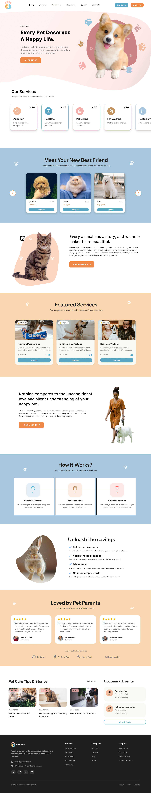

### User Dashboard
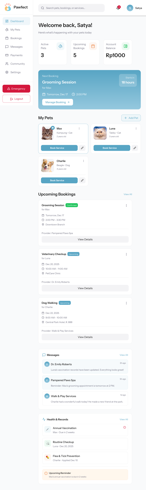

### Adoption Page
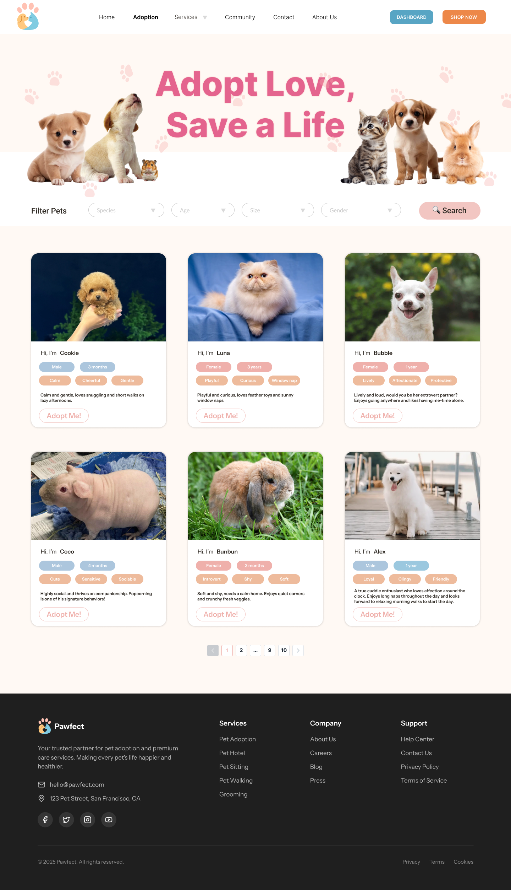

### Login & Register
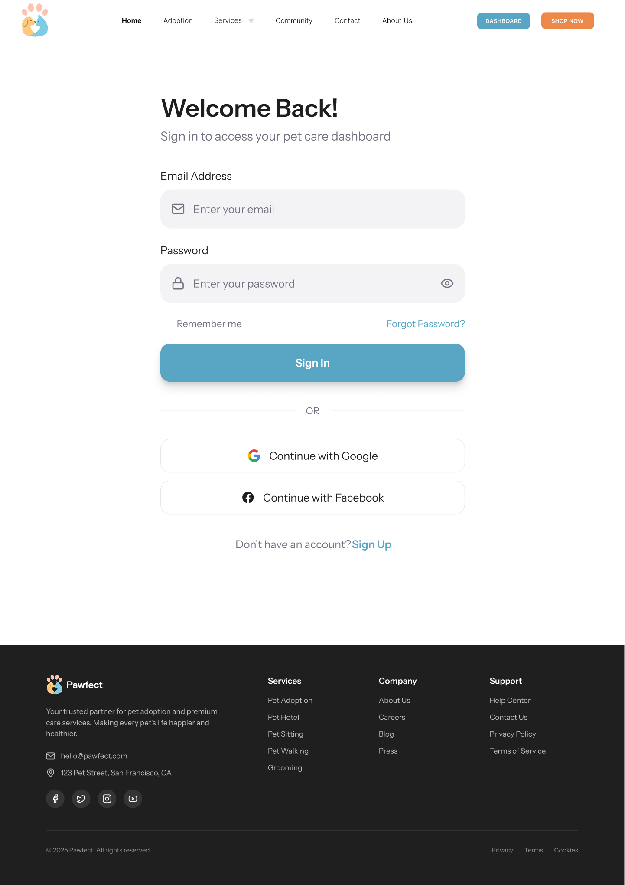
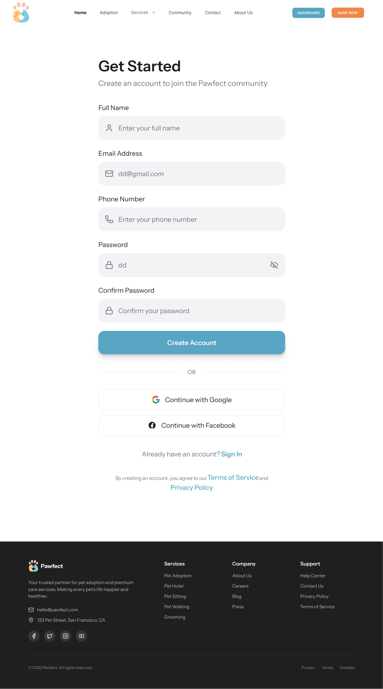

### Pet Services
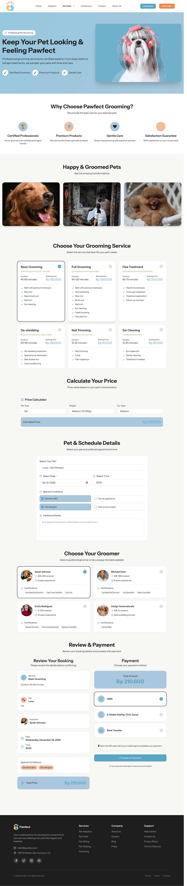
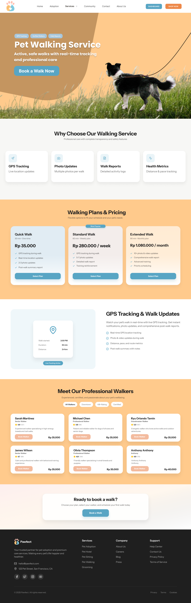
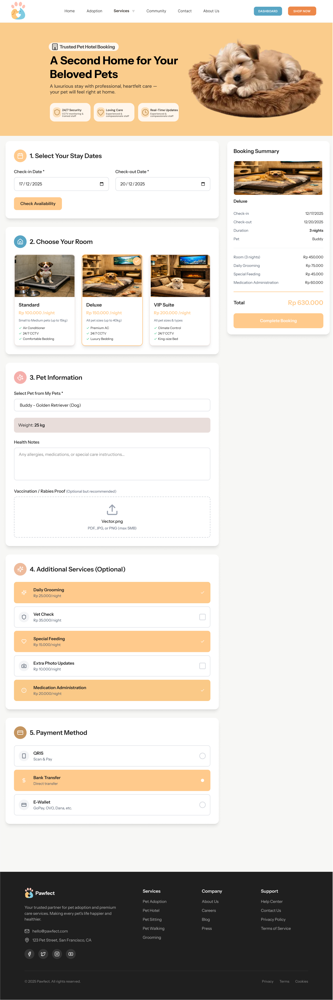
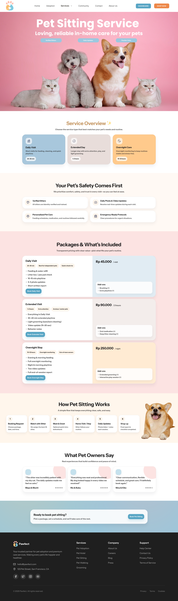

### Community & Information
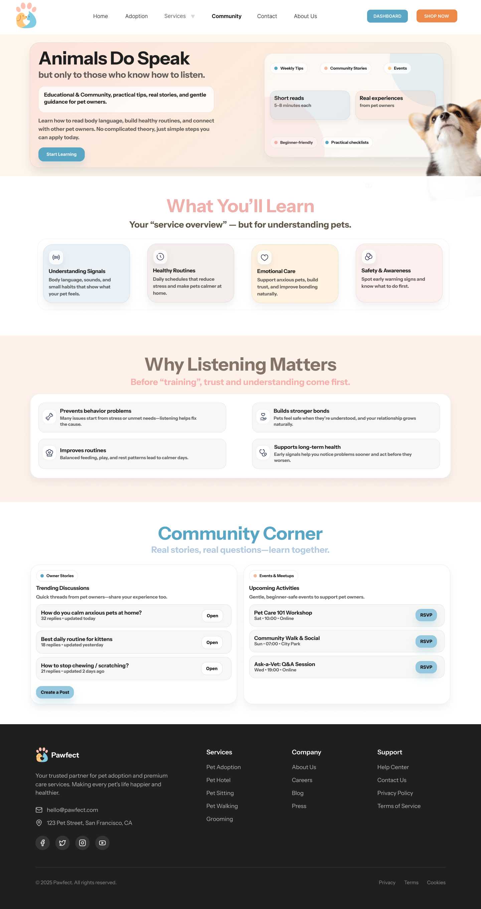
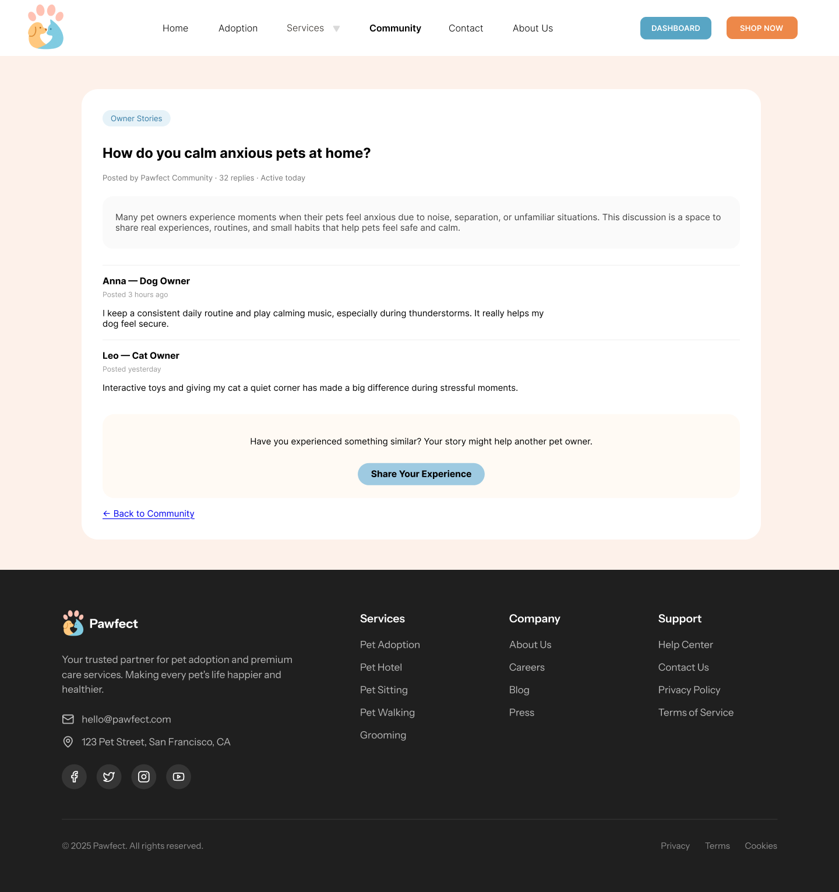
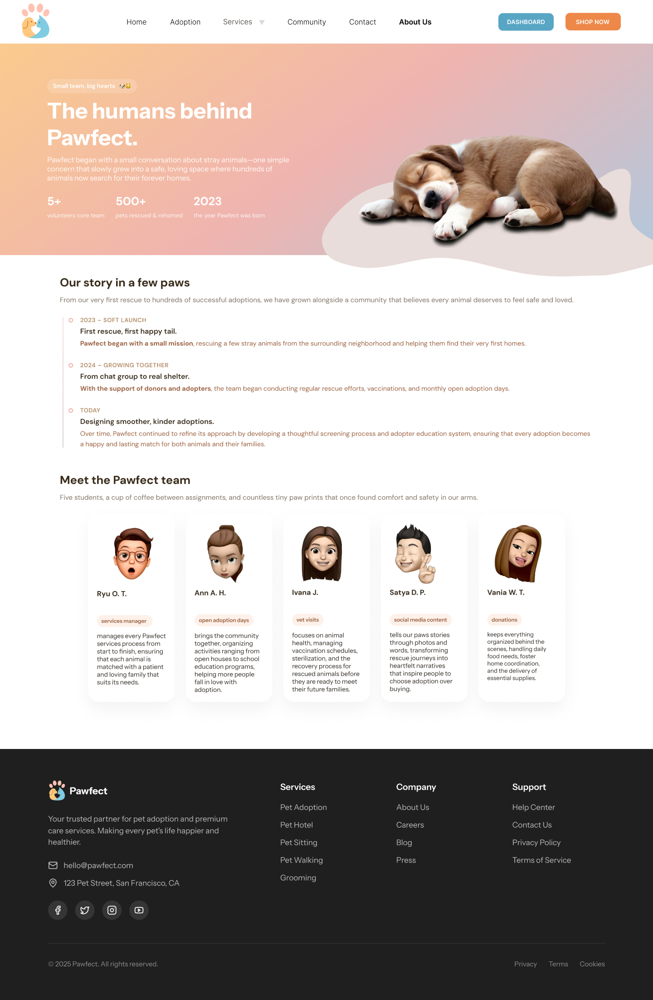

### Contact & Emergency
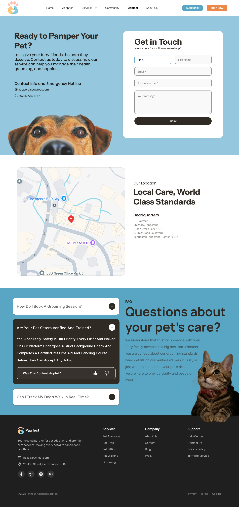

## Figma Prototype
https://www.figma.com/design/m0a8rwENJTh0Q1DbBORzYl/AOL-HCI-Kelompok-2?node-id=0-1&t=OluEbOZ53hnhCLWD-1
